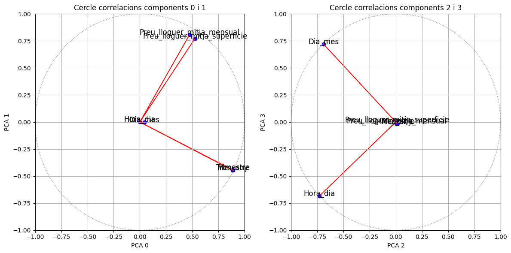

# Prova Data Science Hackató Jump2Digital

## Introducció

Aquest projecte és una anàlisi de dades exhaustiva per al Hackató de Ciència de Dades Prova Jump2Digital, realitzada per Marina Arias Queralt. L'objectiu principal és examinar un conjunt de dades per determinar si els accidents de trànsit dins d'una àrea específica tenen un impacte significatiu sobre els preus mitjans de lloguer mensuals d'habitatges en aquesta zona. L'anàlisi aprofita dos conjunts de dades de l'any 2017 proporcionats per la plataforma Open Data Barcelona:

- `2017_Lloguer_preu_trim.csv`: Conté dades sobre el preu mitjà de lloguer mensual (€/mes) i el preu per superfície (€/m2) a la ciutat de Barcelona.
- `2017_ACCIDENTS_CAUSA_CONDUCTOR_GU_BCN_.csv`: Detalla els accidents de trànsit gestionats per la Guàrdia Urbana a la ciutat de Barcelona.

Les dades per a aquesta anàlisi s'han adquirit a través de l'API d'Open Data Barcelona.

## Neteja de Dades

El procés de neteja de dades per a ambdós conjunts de dades, `df_alquilers` i `df_accidents`, implica diversos passos per assegurar-ne la precisió i la rellevància per a l'anàlisi.

Per a `df_alquilers`:

1. Eliminació de variables redundants com 'Any', 'Nom_Districte' i 'Nom_Barri', que estan disponibles a través dels seus codis corresponents dins dels conjunts de dades.
2. Tractament de valors nuls, particularment dins de la variable 'Preu' en `df_alquilers`. Atès que els valors nuls constitueixen un petit percentatge (6,51%), aquests s'imputen calculant el preu mitjà per al 'Trimestre', 'Lloguer_mitja' i 'Codi_Districte' corresponents.
3. Detecció i gestió d'outliers, on es revisen els preus de lloguer anormalment alts o baixos per confirmar si representen anomalies o són coherents amb les tendències del mercat en àrees d'alt valor com Sarrià-Sant Gervasi o són outliers a causa d'errors en l'introducció de dades, com un preu significativament baix a Vallbona, que serà eliminat.
4. Reorganització de la variable 'Preu' per facilitar la diferenciació entre els lloguers mensuals mitjans i el preu mitjà per metre quadrat, millorant la manipulació i anàlisi de dades futures.

Per a `df_accidents`, es van prendre accions de neteja similars:

1. Eliminació de variables redundants com 'NK_Any', 'Nom_Districte', 'Nom_carrer' i 'Nom_mes' que estan duplicades en altres variables codificades.
2. Les discrepàncies en les convencions de noms de districte entre els dos conjunts de dades es van ajustar per mantenir la coherència per a l'anàlisi comparativa.

## Resultats

La revisió analítica del conjunt de dades unificat ha proporcionat les següents descobertes:

1. La dinàmica dels preus de lloguer, tal com es mostra a través d'una anàlisi descriptiva, presenta variacions distintes entre diferents districtes i períodes de temps, revelant la diversitat del mercat d'habitatge.
2. Les dades d'accidents de trànsit s'han integrat meticulosament, destacant la freqüència i els patrons que correlacionen amb les coordenades espacials.
3. L'Anàlisi de Components Principals (PCA) realitzada sobre les variables numèriques indica que els quatre primers components principals expliquen més del 90% de la variància en el conjunt de dades, proporcionant un espai dimensional reduït, però exhaustiu per a la interpretació.

    - Els biplots PCA per als components 0 i 1 mostren una forta correlació positiva entre *Preu_lloguer_mitja_mensual* (lloguer mitjà mensual) i *Preu_lloguer_mitja_superfície* (lloguer mitjà per superfície), suggerint que aquests factors es mouen conjuntament i són significatius dins l'estructura de preus de lloguer.
    - Les variables *Mes_any* (mes de l'any) i *Trimestre* (trimestre) també mostren un alt grau de correlació per als components 0 i 1, insinuant tendències estacionals en les dades; no obstant això, la seva redundància suggereix la possibilitat d'excloure'n una per evitar la multicolinealitat.
    - Per als components 2 i 3, *Dia_mes* (dia del mes) i *Hora_dia* (hora del dia) són significatius, però inversament correlacionats, indicant patrons potencials en incidents de trànsit dins els cicles diaris i horaris.

4. Les representacions gràfiques il·lustren a més aquestes troballes, oferint una comprensió visual de les relacions de les variables i el seu impacte en les àrees de focus de l'estudi.

## Conclusions

Després d'interpretar les dades i l'anàlisi, s'han tret les següents conclusions:

1. Hi ha una **interacció notable entre els preus de lloguer i les variables temporals**, que poden alinear-se o divergir de les hipòtesis inicials respecte a la influència dels accidents de trànsit en els preus de lloguer.
2. **La distribució geogràfica i els patrons temporals dels accidents de trànsit han emergit amb claredat**, revelant punts calents potencials i correlacions temporals.
3. Aquestes intuïcions proporcionen informació valuosa per a estratègies de desenvolupament urbà, models de preus immobiliaris i polítiques de gestió de trànsit, contribuint potencialment a processos de presa de decisions més informats.
4. Tot i que els resultats actuals són reveladors, hi ha espai per a recerca futura. Anàlisis posteriors podrien ampliar l'abast temporal, incloure una gamma més àmplia de variables o fins i tot explorar la causalitat entre els preus de lloguer i els incidents de trànsit per aprofundir la comprensió i la rellevància política.
